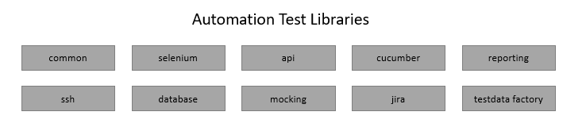

...how about jump start the application test automation rather than typical heavy upfront investment for framework creation. 

## Automation Test Library: ATOM

**A series of loosely coupled java libraries with code collected from multiple test projects.** 

**The aim is to allow new test projects to re-use these libraries and to focus primarily on developing the test cases and test code itself rather than the typical heavy upfront investment in framework creation.**
**The aim is to allow new test projects to re-use these libraries and to focus primarily on developing the test cases and test code itself rather than the typical heavy upfront investment in framework creation.**




**The libraries include support for:**

- api testing
- browser testing
- mobile app testing
- output reporting
- database connectivity
- ssh connectivity and running backend server commands (to be added)
- test data factory(to be added)
- interface mocking(to be added)
- parallel test execution
- jira integration


The links below provide readme guides for each individual library.  

[library-common](library-documentation/library-common.md)

[library-api](library-documentation/library-api.md)

[library-selenium](library-documentation/library-selenium.md)

[library-cucumber](library-documentation/library-cucumber.md)

[library-dbutils](library-documentation/library-cucumber.md)

[library-jira](library-documentation/library-jira.md)

[library-mq](library-documentation/library-mq.md)

[library-reporting](library-documentation/library-reporting.md)

[library-reporting-allure](library-documentation/library-reporting_allure.md)

A project can use all or some of the libraries according to its test requirement (only the common library must always be used).  The libraries are available as a set of version controlled jars which can be simply imported into a test project or the source code can be cloned and adapted locally for the project as needed.

ATOM libraries can be used in combination depending on the project automation scope. 

* API with BDD – Common + API + Cucumber + Reporting*
* API with TestNG – Common + API
* Web/Mobile with BDD – Common + Selenium + Cucumber + Reporting*
* Web/Mobile with TestNG – Common + Selenium

`*Extent or Allure, depending on the choice of project`

```**There are other supporting libraries – Db (Oracle, MySQl, Sybase, Mongo), Jira, Wiremock and Messaging Queue (Rabbit MQ) which can be used with any of combination above.``` 


There are also a series of sample test projects which can act as project templates.

Selenium/Appimm Demo (test execution using TestNG, NO BDD)- sample_selenium

Cucumber Selenium/Appium Demo: sample-cucumber-selenium

Cucumber API Demo: sample-cucumber-api
