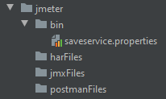
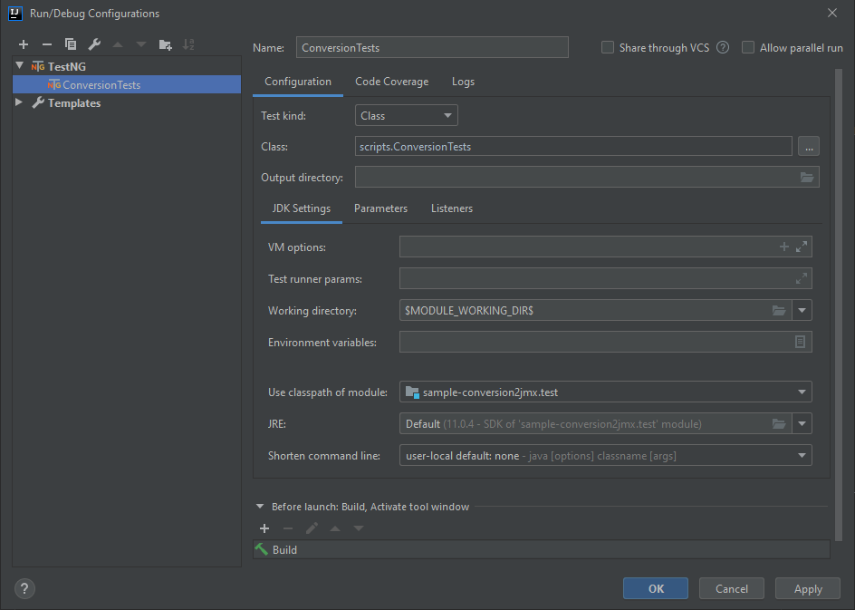

## Sample Conversion2Jmx
A sample project using various automation libraries for creating JMeter JMX files from different sources.

    library-common
    library-conversion2jmx
    library-selenium

### Set up

1. Clone the repo  (https://github.com/Accenture/atom.git)
2. Import/Open `sample-selenium-conversion2jmx` project in IDE (gradle refresh to pull the respective dependencies) 
3. Download and save the Chrome (chromedriver), Firefox (geckodriver), or Internet Explorer (IEDriverServer) driver in 
`<project folder path>\lib\drivers\windows` (if OS is windows)

#### Directory Locations
Please ensure that the following folder structure exists within the project:
The `jmeter` folder should exist within  `<project folder path>\jmeter` and have the structure as shown in the 
screenshot below.

### Test Execution

- Running test using TestNG
    - Select `Template -> TestNG` and enter below details as shown in screenshot below.
    

##### Intellij configuration - Edit Configurations VM Options
    Name                    :   ConversionTests
    Test Kind               :   Class
    Class                   :   scripts.ConversionTests
    VM Options              :   -Dcukes.techstack=LOCAL_CH
                                -Dcukes.webdrivermanager=false
                                -Dcukes.enableHar2Jmx=true
                                -Dcukes.selenium.defaultFindRetries=1
    Use classpath of module :   sample-conversion2jmx.test

Note: 
- To run the test in another browser update the run config (LOCAL_IE - Internet Explorer, LOCAL_FF - Firefox etc) 
and copy the respective driver in drivers folder.
- `enableHar2Jmx` should only be set for Selenium -> HAR -> JMX conversion and may cause errors if used outside of this.

Include below VM options to download the Chrome driver during runtime:

    -Dcukes.chromeDriver=<chrome version number>
    -Dcukes.webdrivermanager=true

Note: For this project, code libraries are directly used within the project instead of using jar libraries. 

## Selenium -> HAR -> JMX

### Test Execution

Ensure that `-Dcukes.enableHar2Jmx=true` exists within the VM options of the test you are about to run.

Within the `ConversionTests` class, execute the below test:

    @Test(dataProvider = "techStackJSON")
    public void runSelenium2Jmx(Map<String, String> map) throws Exception {
        getDriver().get("https://www.google.co.uk/");
    
        getDriver().get("https://uk.yahoo.com/");
    
        getDriver().get("https://www.bing.com/");
    }

Once executed, the `-Dcukes.enableHar2Jmx=true` option will trigger the recording of HAR data which is collected during 
the execution of the test's Selenium code. Once the test is finished, the HAR data collected will be written to a HAR 
file (see 'Outputs' section) and used to create a JMX file (see 'Outputs' section).

### Outputs

- HAR file will be generated within `jmeter\harFiles`.
- JMX file will be generated within `jmeter\jmxFiles`.

Note: the above locations can be changed within the 
`<project folder path>\src\test\resources\config\selenium\runtime.properties` file by changing the values of the 
`harPath` and `jmxPath` properties.

## HAR -> JMX

### Inputs

- HAR file(s) are stored within `jmeter\harFiles`.

Note: the above location can be changed within the 
`<project folder path>\src\test\resources\config\selenium\runtime.properties` file by changing the values of the 
`harPath` property.

### Test Execution
All HAR files that are to be converted into JMX format should exist within the `jmeter\harFiles` directory. Also, the 
filenames of the exact HAR files to be converted should be passed into the test. See the below code snippet for an 
example:

    @Test(dataProvider = "techStackJSON")
    public void runHar2Jmx(Map<String, String> map) throws Exception {
        HarHelper.getInstance().createJmx(new ArrayList<>(Arrays.asList("foo.har", "bar.har")));
    }

Within the above test, the `jmeter\harFiles` directory will be searched for any file names `foo.har` and `boo.har`. 
Since these are the only two filenames passed as parameters, these are the only files which will be converted into JMX 
format.

Once the test is finished, the HAR data will have been used to create JMX file(s) (see 'Outputs' section).

### Outputs

- JMX file(s) will be generated within `jmeter\jmxFiles`.

Note: the above location can be changed within the 
`<project folder path>\src\test\resources\config\selenium\runtime.properties` file by changing the values of the 
`jmxPath` property.

## Postman -> JMX

### Inputs

- Postman file(s) are stored within `jmeter\postmanFiles`.

Note: the above location can be changed within the 
`<project folder path>\src\test\resources\config\selenium\runtime.properties` file by changing the values of the 
`postmanPath` property.

### Test Execution
All Postman files that are to be converted into JMX format should exist within the `jmeter\postmanFiles` directory. 
Conversion of Postman files into a JMX format can be achieved in 2 different ways.

##### Approach One
All files that exist with the `jmeter\postmanFiles` directory can be read and converted into JMX format. See the below 
code snippet for an example:

    @Test(dataProvider = "techStackJSON")
    public void runPostman2Jmx(Map<String, String> map) throws Exception {
        Postman2Jmx postman2Jmx = new Postman2Jmx();
        postman2Jmx.convertAllPostmanScripts();
    }

Once the test is finished, the Postman data will have been used to create JMX file(s) (see 'Outputs' section).

##### Approach Two
The filenames of the exact Postman files to be converted can be passed into the test. See the below code snippet 
for an example:

    @Test(dataProvider = "techStackJSON")
    public void runPostman2Jmx(Map<String, String> map) throws Exception {
        Postman2Jmx postman2Jmx = new Postman2Jmx();
        postman2Jmx.convertSpecificPostmanScripts(new ArrayList<>(Arrays.asList("foo.json", "bar.json")));
    }

Within approach two, the `jmeter\postmanFiles` directory will be searched for any file names `foo.json` and `boo.json`. 
Since these are the only two filenames passed as parameters, these are the only files which will be converted into JMX 
format.

Once the test is finished, the Postman data will have been used to create JMX file(s) (see 'Outputs' section).

### Outputs

- JMX file(s) will be generated within `jmeter\jmxFiles`.

Note: the above location can be changed within the 
`<project folder path>\src\test\resources\config\selenium\runtime.properties` file by changing the values of the 
`jmxPath` property.