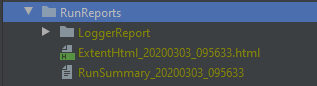
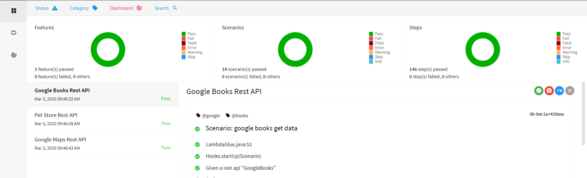
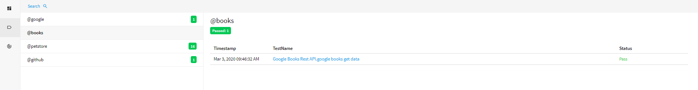
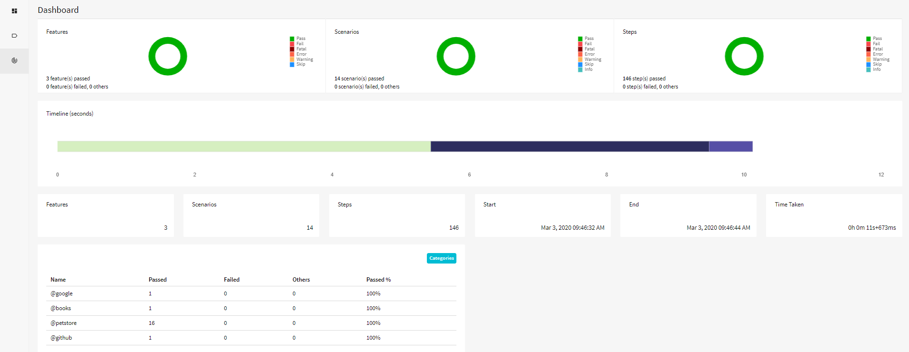
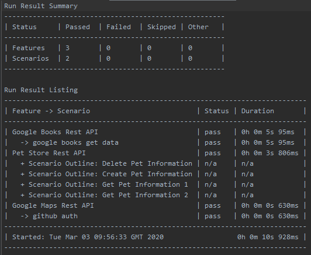

## Sample Cucumber Selenium
A sample project using various automation libraries for api test execution using Cucumber and generating Extent Report.

    library-common
    library-api
    library-cucumber
    library-reporting

For API test execution only hooks and runner classes are required. Basic gherkin steps are implemented in library-cucumber library. 
If there is any requirement then custom step class can be added.  
 
### Set up

- Clone the repo  (https://github.com/Accenture/atom.git)
- Import/Open `sample-cucumber-api` project in IDE (gradle refresh to pull the respective dependencies) 

### Test Execution
- Select `Template -> TestNG` and enter below details as shown in screenshot below.

##### Intellij configuration - Edit Configurations VM Options
Sequential Execution -  

    Name                    :   testNGCucumber
    Test Kind               :   Suite
    Suite                   :   src/test/resources/testsuites/apitests.xml
    VM Options              :   -Dcukes.env=devtest
    Shorten command line    :   classpath file

Parallel Execution -  

    Name                    :   testNGCucumber
    Test Kind               :   Suite
    Suite                   :   src/test/resources/testsuites/apitests_Parallel.xml
    VM Options              :   -Dcukes.env=devtest
    Shorten command line    :   classpath file

### Test Execution - Command Line
- From the terminal execute following command

    gradle cukes -Dcukes.env=devtest -Dcukes.testsuite=apitests --info
     
### Execution Summary Reports

##### HTML Reports
The main output is a rich html report (ExtentReport 4) with test run statistics, summary and detailed test results with drilldowns.  

##### Run Summary - Text Report
A supplementary text report (suitable for email) with tabular results.

