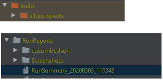
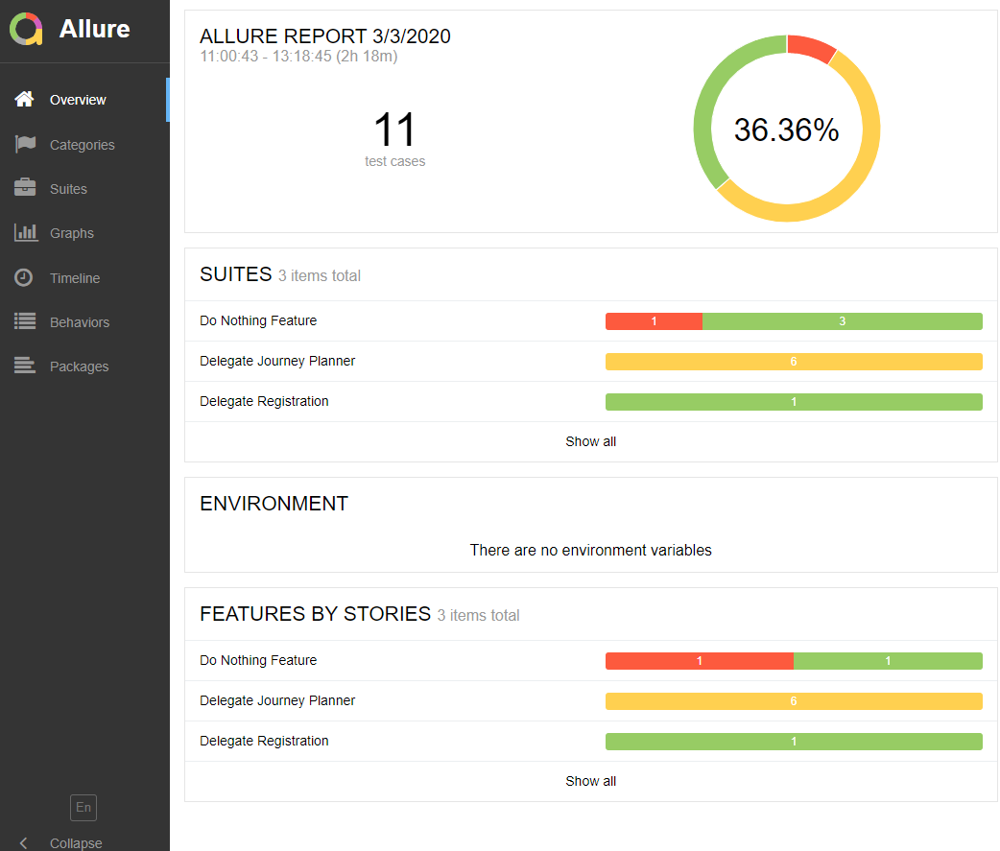
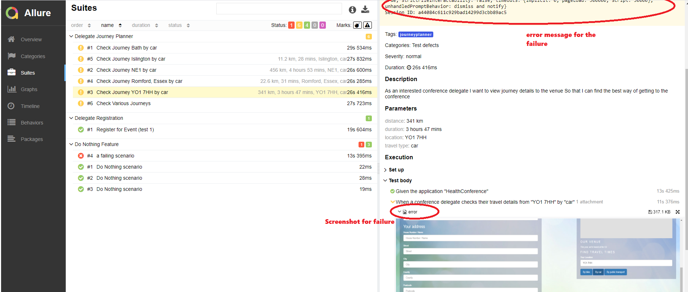
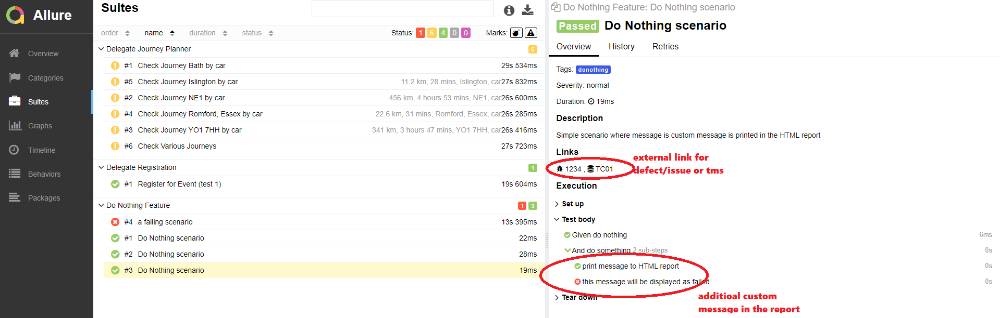
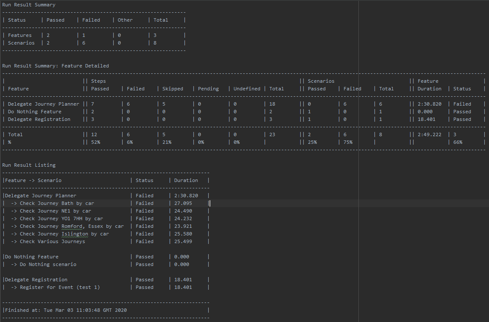

## Sample Cucumber Selenium
A sample project using various automation libraries for web and mobile test execution using Selenium/Cucumber and generating Allure Report.

    library-common
    library-selenium
    library-cucumber
    library-reporting
    library-api

### Set up

- Clone the repo  (https://github.com/Accenture/atom.git)
- Import/Open `sample-cucumber-selenium-Allure` project in IDE (gradle refresh to pull the respective dependencies) 
- Download and save the chromedriver on `<project folder path>\lib\drivers\windows` (if OS is windows)

### Test Execution
#### Using Run Config
- Select `Template -> TestNG` and enter below details as shown in screenshot below.

##### Intellij configuration - Edit Configurations VM Options
    Name                    :   testNGCucumber
    Test Kind               :   Suite
    Suite                   :   src/test/resources/testsuites/browsertests.xml
    VM Options              :   -Dcukes.env=devtest
                                -Dcukes.techstack=LOCAL_CH
                                -Dorg.apache.logging.log4j.level=DEBUG
                                -Dcukes.selenium.defaultFindRetries=1
                                -DscreenshotOnFailure=true
    Shorten command line    :   classpath file

Note: to run the test in another browser update the run config (LOCAL_IE - Internet Explorer, LOCAL_FF - Firefox etc) and copy the respective driver in drivers folder.

#### Using Command Line 
    gradlew cucumberTag -Dcukes.techstack=LOCAL_CH -Dcukes.env=devtest -DscreenshotOnFailure=true -Dcukes.tags=@donothing

### Execution Summary Reports

##### HTML Reports
The main output is a rich html report (Allure) with test run statistics, summary and detailed test results with drilldowns, and embedded screenshots.

To view the allure report execute `gradlew allureServe`.

##### Run Summary - Text Report
A supplementary text report (suitable for email) with tabular results.

