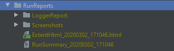
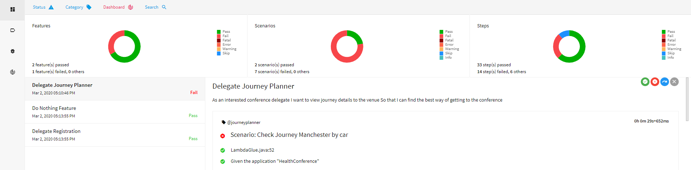
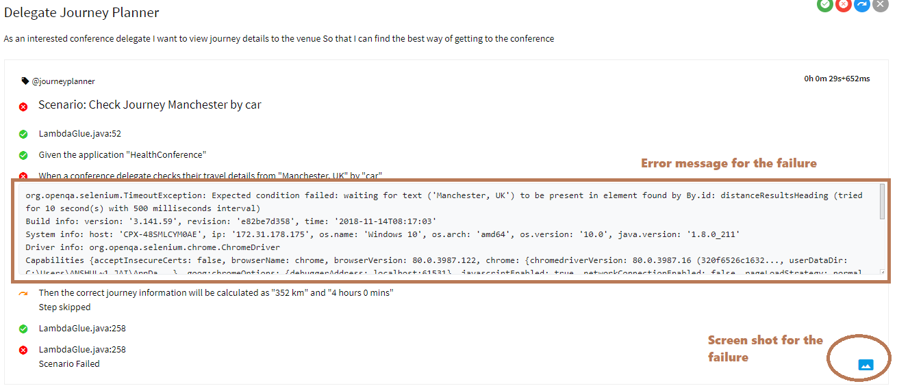
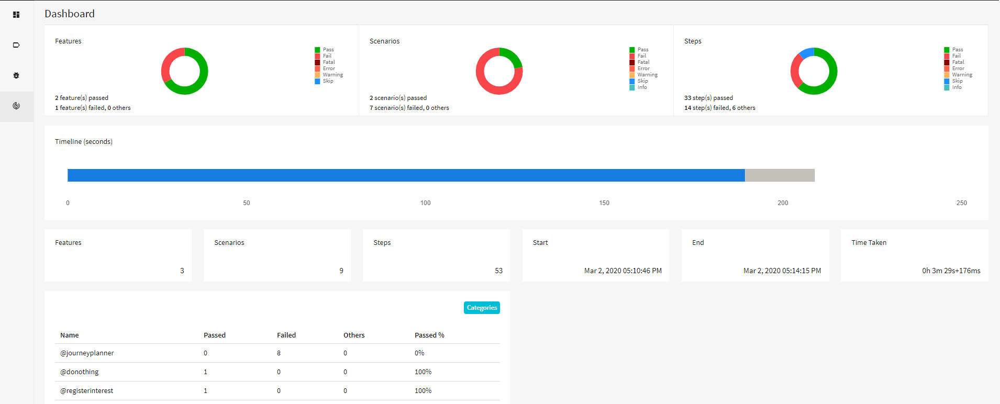
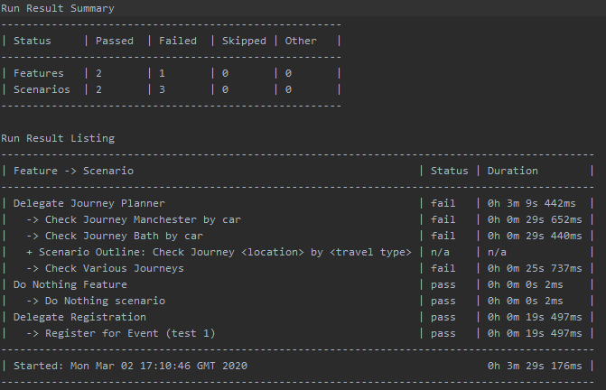

## Sample Cucumber Selenium
A sample project using various automation libraries for web and mobile test execution using Selenium/Cucumber and generating Extent Report.

    library-common
    library-selenium
    library-cucumber
    library-reporting
    library-api

### Set up

- Clone the repo  (https://github.com/Accenture/atom.git)
- Import/Open `sample-cucumber-selenium` project in IDE (gradle refresh to pull the respective dependencies) 
- Download and save the chromedriver on `<project folder path>\lib\drivers\windows` (if OS is windows)

### Test Execution
- Select `Template -> TestNG` and enter below details as shown in screenshot below.

##### Intellij configuration - Edit Configurations VM Options
    Name                    :   testNGCucumber
    Test Kind               :   Suite
    Suite                   :   src/test/resources/testsuites/browsertests.xml
    VM Options              :   -Dcukes.env=devtest
                                -Dcukes.techstack=LOCAL_CH
                                -Dorg.apache.logging.log4j.level=DEBUG
                                -Dcukes.selenium.defaultFindRetries=1
                                -DscreenshotOnFailure=true
    Shorten command line    :   classpath file

Note: to run the test in another browser update the run config (LOCAL_IE - Internet Explorer, LOCAL_FF - Firefox etc) and copy the respective driver in drivers folder.

##### CLI execution
for headless chrome

'gradle cukes -Dcukes.env=devtest -Dcukes.techstack=LOCAL_CH -Dorg.apache.logging.log4j.level=DEBUG -Dcukes.selenium.defaultFindRetries=1 -DscreenshotOnFailure=true -Dcukes.testsuite=browsertests -Dchrome.options=--headless'

for non headless

'gradle cukes -Dcukes.env=devtest -Dcukes.techstack=LOCAL_CH -Dorg.apache.logging.log4j.level=DEBUG -Dcukes.selenium.defaultFindRetries=1 -DscreenshotOnFailure=true -Dcukes.testsuite=browsertests'

### Execution Summary Reports

##### HTML Reports
The main output is a rich html report (ExtentReport 4) with test run statistics, summary and detailed test results with drilldowns, and embedded screenshots.  

##### Run Summary - Text Report
A supplementary text report (suitable for email) with tabular results.

Note: For this project libraries code is directly used instead of libraries jar. 